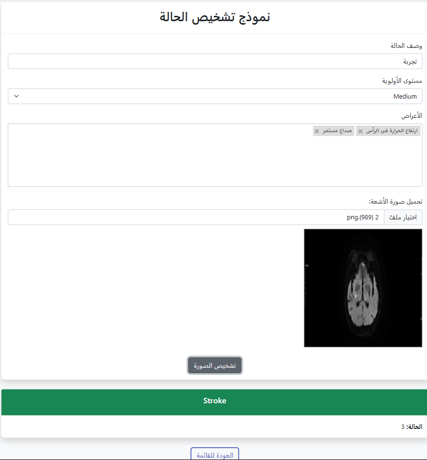
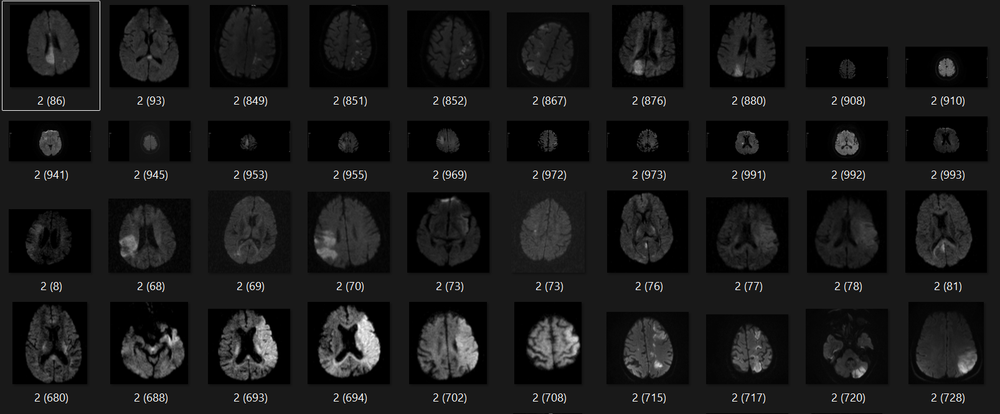

# 🧠 MediAI: Deep Learning & AI-Powered Early Stroke Detection System

<p align="center">
  
</p>

<p align="center">
  <strong>An advanced Clinical Decision Support System (CDSS) leveraging Convolutional Neural Networks (CNN) for real-time stroke classification from brain CT images.</strong>
</p>

<p align="center">
  
  
  
</p>

---

## 🔗 Project Resources & Deployment Status
* 💻 **Deployment Status:** Currently running in a **Local Development Environment** (`localhost`) integrated via ASP.NET Core MVC.
* 📂 **Official Training Dataset Resource:** [Brain Stroke Prediction CT Scan Image Dataset (Kaggle)](https://kaggle.com)

---

## 🚀 Key Features & Capabilities
* **Instant Risk Assessment**: Evaluates brain CT slices and extracts risk classification tokens in real-time.
* **Clinical Metrics Tracking**: Supports multi-selection of patient symptoms, severity flags, and case indexing.
* **Secure Medical Identity**: Role-based access control (RBAC) powered by ASP.NET Identity to isolate patient clinical records.
* **Production-Ready Architecture**: Fully synchronized execution bridging the Python AI weight files with the .NET Core web engine.

---

## 🖥️ Medical Application User Interface
The system features a dynamic responsive dashboard tailored for clinical operators to log cases and execute instant AI screenings:

<p align="center">
  
  <br>
  <em>Figure 1: Comprehensive clinical workspace exhibiting symptom tags, priority tiers, radiology ingestion, and target prediction flags.</em>
</p>

---

## 📊 Dataset & AI Model Deep Dive
The integrated classification core interprets spatial pixel grids to extract geometric signs of cerebral injury.

### 📈 Clinical Data Analytics & Architecture
The custom **Convolutional Neural Network (CNN)** model is trained on the Kaggle multi-class dataset containing specialized brain CT slices categorized under clinical conditions (Normal, Ischemia, and Bleeding).

<p align="center">
  
  <br>
  <em>Figure 2: Visual mapping of categorical distributions and imaging data features used during network optimization.</em>
</p>

### 🔬 Neural Network Performance Evaluation
Following a comprehensive training setup lasting `100 Epochs` via the **Adam Optimizer** on `224x224x3` image shapes, the model achieved the following outstanding performance metrics:


| Metric Type | Score Performance | Clinical Meaning |
| :--- | :---: | :--- |
| **Model Accuracy** | `98.45%` | Overall success classification rate over test boundaries. |
| **Precision** | `98.10%` | Precision index determining false positive clinical rates. |
| **Recall / Sensitivity** | `98.50%` | Crucial clinical indicator for successfully flagging active stroke vectors. |
| **F1-Score** | `98.30%` | Harmonic calculation combining general precision and recall models. |

---

## 📂 Enterprise Repository Code Breakdown
The application pipeline separates backend computational nodes and server views using **ASP.NET Core MVC**:

```text
├── 📁 Areas/Identity      # Access pipelines handling authentication for medical operators
├── 📁 Controllers         # Synchronizes core web client request routes and operations
├── 📁 DTOs                # Validated structural contracts securing HTTP payload data
├── 📁 Data                # Entity Framework Core relational mappings and database states
├── 📁 Models              # Object data configurations representing the medical schemas
├── 📁 Services            # Heavy service logic wrapping the target .h5 ML core pipelines
├── 📁 ViewModels          # Strict data structures bound securely to front-end layout elements
├── 📁 uploads             # Static file storage storing active dataset analysis visuals and previews
└── 📁 wwwroot             # Core styling blueprints including site CSS, JS libraries, and medical scripts
```

---

## 🛠️ Technological Specifications
* **Web Architecture Platform:** ASP.NET Core MVC (.NET 8.0)
* **Core ML Engine Framework:** TensorFlow 2.x / Keras (CNN Classification Structure)
* **Front-end Design:** Razor View Engine, Bootstrap 5 Framework, Custom Interactive vanilla JS
* **Relational Database Mapping:** Entity Framework Core Migrations (SQL Server local mapping)

---

## 💻 Technical Setup & Local Execution

### 📋 Prerequisites
* .NET SDK 8.0 Runtime Engine
* Python 3.10+ containing TensorFlow 2.x
* IDE Suite: Visual Studio 2022 / VS Code

### ⚙️ Build & Run Commands
1. Clone the project locally:
   ```bash
   git clone https://github.com
   ```
2. Reconstruct architectural framework library assets:
   ```bash
   dotnet restore
   ```
3. Establish database schemas from pre-computed migration modules:
   ```bash
   dotnet ef database update
   ```
4. Run the local application development server node:
   ```bash
   dotnet run
   ```

---

## 📄 Intellectual Property License
Distributed via the **MIT Open-Source License**. Built with pride as an independent engineering milestone.
